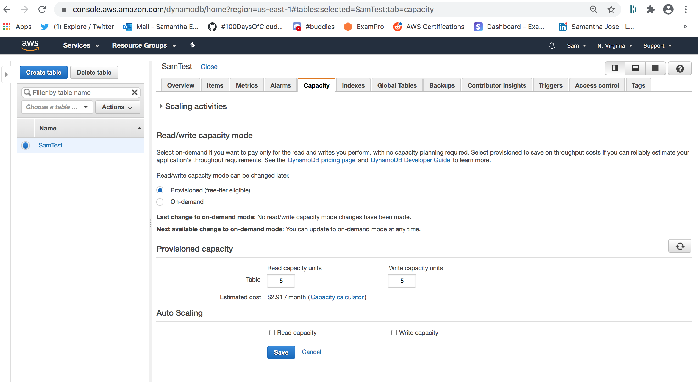
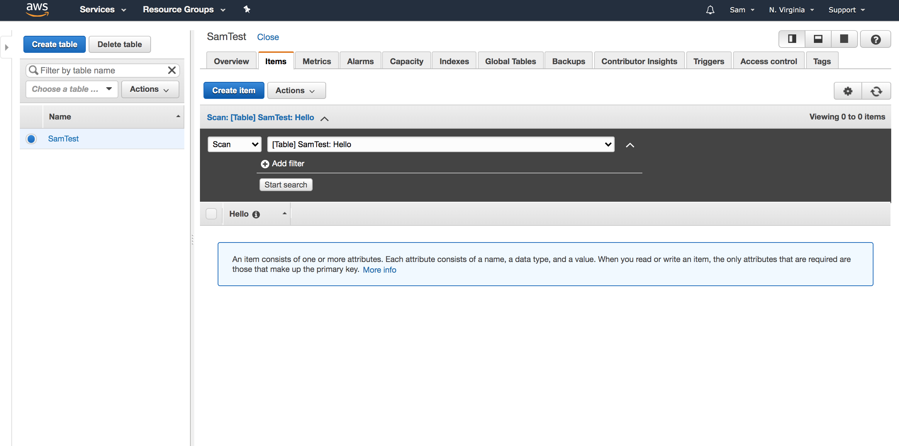
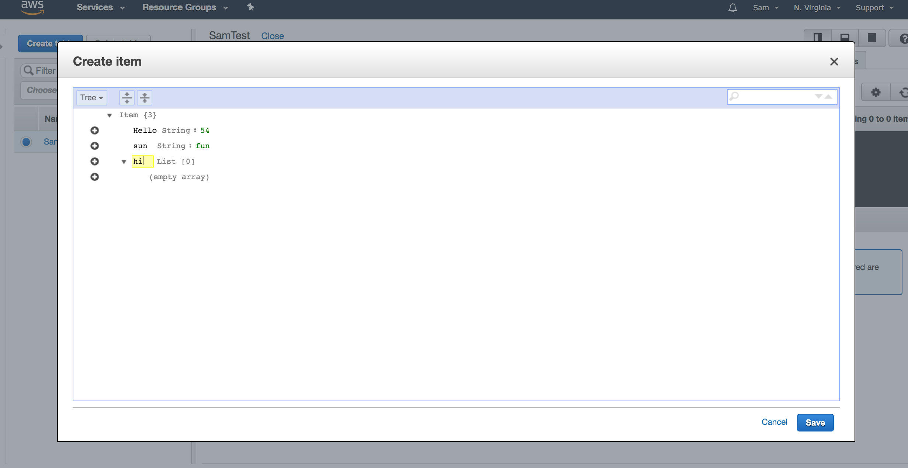
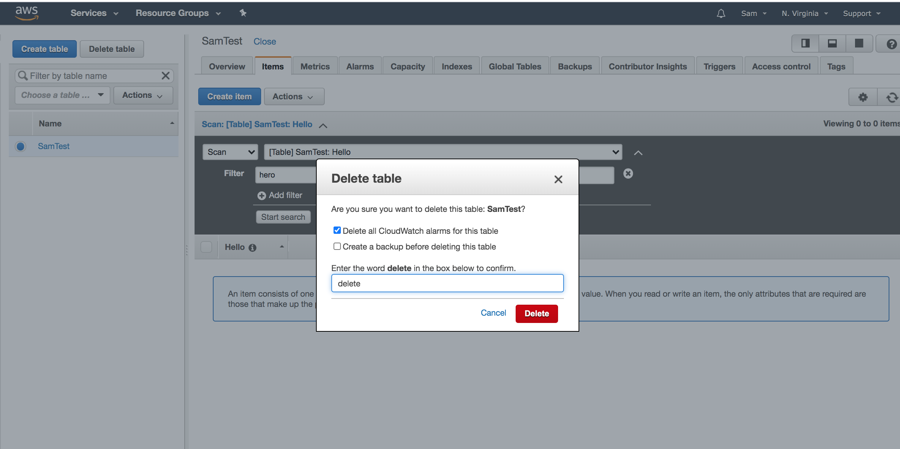

# Create a DynamoDB

## Introduction:

**I chose to do the DynamoDB project from 100DaysOfCloud because I would hear people talk about DynamoDB and I wanted to get a better understanding of it.**

## Prerequisite:

**To be honest I'm not sure what base knowledge you need for DynamoDB, definitely Certified Cloud Practitioner.**

## Cloud Research:

## Create DynamoDB Table with Provisioned Capacity

**Click Create Table**

**Name Table and Partition Key then Select Create**

**Click on Capacity Tab, Select Provisioned (free tier eligible) and Click Save**

## Create 3 Random Items in the table

**Click on Items Tab and Create item**

**Enter in your Item Info and Click Save, Do this 2 more times**

## Run a scan on the table that returns all 3 items

**(Not really sure what I’m doing so I’m going to watch some videos on youtube)**

**I scanned table but I’m lost on how to return all 3 items... So I’m going to skip this and be done for today** 🤷‍♀️ 

 

## How to Delete Table 

**I’m going to delete my table**

**Click Delete**

## Does DynamoDB support Encryption?

**Yes DynamoDB supports encryption**

## What are Global Tables?

**Global tables is a replica of one or more replica tables all from one AWS account.**

## Cloud Outcome

**I learned that DynamoDB is confusing and I will need to take more time to understand it, but I did learn how to make the DynamoDB with provisioned capacity and how to create items in a table.**

## Next Steps

**I'm going to checkout more of the project ideas tomorrow to see what intrests me next to learn!**

## Social Proof

**! https://twitter.com/sammy5_j/status/1284537490720690176

